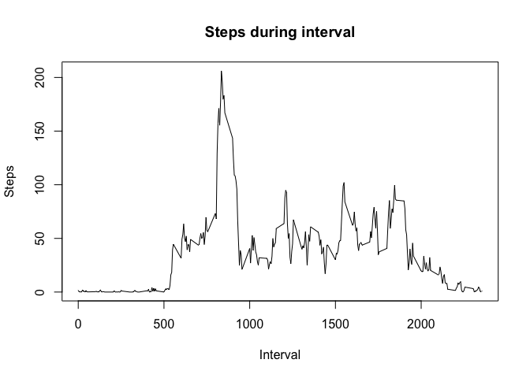
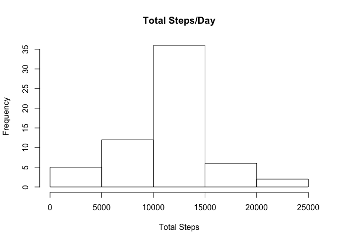
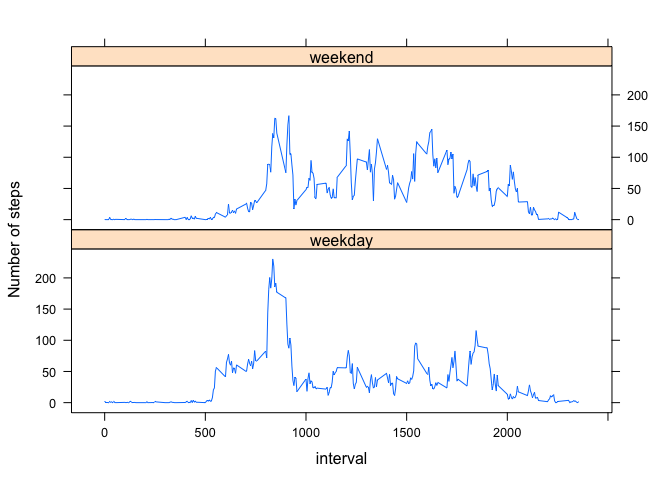

# Reproducible Research: Peer Assessment 1


## Loading and preprocessing the data

1. The data is available in the cloned repository as a csv file (activity.csv). 
It is read into R as follows:


```r
data<- read.csv("activity.csv")
```

## What is mean total number of steps taken per day?

1. The total number of steps per day is calculated by using the aggregate function on the data. Using the 
resulting data frame, a histogram is constructed. 


```r
tot <- aggregate(steps ~ date, data, sum)
hist(tot$steps, xlab="Total Steps", main="Total Steps/Day") 
```

 

2. The mean total number of steps is:


```r
mean(tot$steps)
```

```
## [1] 10766.19
```

and the median total number of steps is:


```r
median(tot$steps)
```

```
## [1] 10765
```


## What is the average daily activity pattern?

1. The average number of steps during each 5-minute interval across all days is calculated using the
aggregate function and the values are plotted.


```r
avgDaily <- aggregate(steps ~ interval, data, mean)
plot(avgDaily$interval, avgDaily$steps, type="l", 
     main="Steps during interval", xlab="Interval", ylab="Steps")
```

 

2. The 5-minute interval containing the maximum number of steps is:


```r
avgDaily[which(avgDaily$steps == max(avgDaily$steps)),]
```

```
##     interval    steps
## 104      835 206.1698
```

## Imputing missing values

1. The total number of missing values for steps in the dataset is:


```r
length(which(is.na(data$steps)))
```

```
## [1] 2304
```

2. The following function substitutes the value for the average for the 5-minute interval in case the 
steps value is missing.


```r
imputemiss <- function(data, avg)
{
  for (j in 1:nrow(data))
  {
    if(is.na(data$steps[j]))
    {
      data$steps[j] = avg[which(avg$interval == data$interval[j]),]$steps
    }
  }
  data
}
```

3. Using the avgDaily data frame created in above section, the missing values are imputed.


```r
iData <- imputemiss(data,avgDaily)
```

4. Using the new data frame with imputed values, the total steps per day is calculated and a histogram
is constructed. The histogram is very similar to the one constructed using the data frame with missing values.


```r
itot <- aggregate(steps ~ date, iData, sum)
hist(itot$steps, xlab="Total Steps", main="Total Steps/Day") 
```

 

The mean total number of steps using the imputed data frame is


```r
mean(itot$steps)
```

```
## [1] 10766.19
```

and the median is

```r
median(itot$steps)
```

```
## [1] 10766.19
```

The mean is the same as the one obtained from the data with missing values. This is to be expected since the missing values were replaced with the mean. The median in the imputed data frame is the same as the mean and is higher than the previous median.

## Are there differences in activity patterns between weekdays and weekends?

1. In the imputed data frame, a new variable is added for day of the week.


```r
iData$day<-weekdays(as.Date(iData$date))
```

and the following function is used to change the "day" variable as a factor with two possible values, 
"weekend" and "weekday".


```r
setweekday<- function(d)
{
  for (i in 1:nrow(d))
  {
    if(d$day[i]=="Saturday" | d$day[i]=="Sunday" )
      d$day[i]="weekend"
    else
      d$day[i]="weekday"
  }
  d
}

wiData <- setweekday(iData)
```

2. Average steps per 5-minute interval per weekends and weekdays is calculated and a panel plot showing the differences is constructed using the lattice system.


```r
iavgDaily <- aggregate(steps ~ interval + day, wiData, mean)
library(lattice)
xyplot(steps ~ interval | day, data=iavgDaily, type="l",layout=c(1,2), ylab="Number of steps")
```

 
